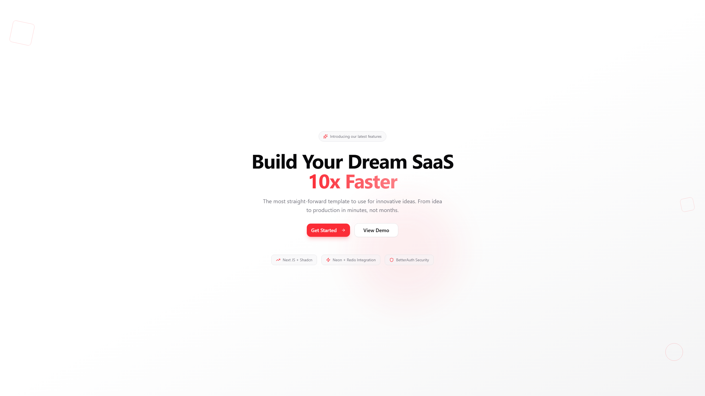

# BetterNext

A modern **Next.js + shadcn/ui** template with **Better Auth**, **Prisma + Neon PostgreSQL**, and **Redis** integration via **Docker Compose**.

---

## 🧩 Tech Stack
- **Next.js 15** with **Turbopack**
- **shadcn/ui** for components
- **Better Auth** for authentication
- **Prisma ORM** with **Neon PostgreSQL**
- **Redis** (Docker Compose)
- **TypeScript**, **ESLint**, **Prettier**

---

## 🚀 Usage

### 1. Clone and install
```bash
git clone https://github.com/roee1454/BetterNext
cd BetterNext
pnpm install
```

### 2. Environment setup
Create a `.env` file in the project root and fill in your variables (see `.env.example`).

Import to Vercel:
```bash
pnpm vercel-env
```

### 3. Development
```bash
pnpm dev
```

### 4. Build & deploy
```bash
pnpm vercel-build
```

### 5. Run production
```bash
pnpm start
```

---

Built with ❤️ for modern full-stack development.

